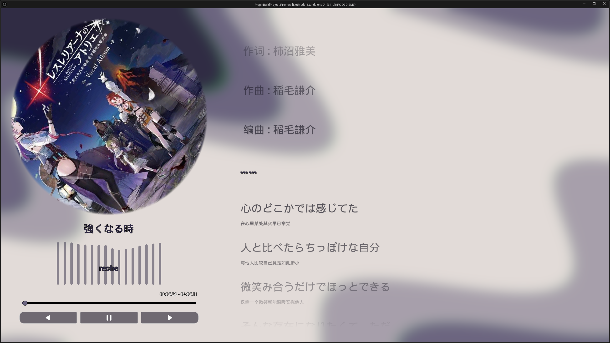
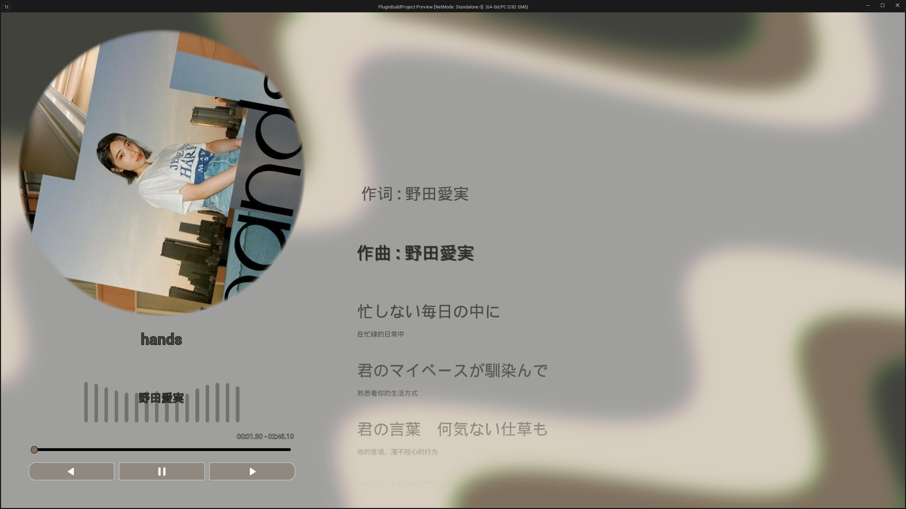

# Dream Music Player Sample Project

---

## Engine Version : 5.5

## Plugins : [GitHub - TypeDreamMoon/DreamMusicPlayer: Unreal Engine 5.x Music Player Plugins](https://github.com/TypeDreamMoon/DreamMusicPlayer)

---

## How To Use :

Step 00 : Check if your engine version is `Unreal Engine 5.5`

Step 01 : [Download repository](https://github.com/TypeDreamMoon/DreamMusicPlayerSample)

Step 02 : [Download the plug-in repository (Releases have Build versions)](https://github.com/TypeDreamMoon/DreamMusicPlayer/releases)

Step 03 : Unzip the project to one place

Step 04 : Open the project folder and create a new folder `Plugins`, to extract the plug-in into the `Plugins` folder

Step 05 : Start a project

---

## Preview :

